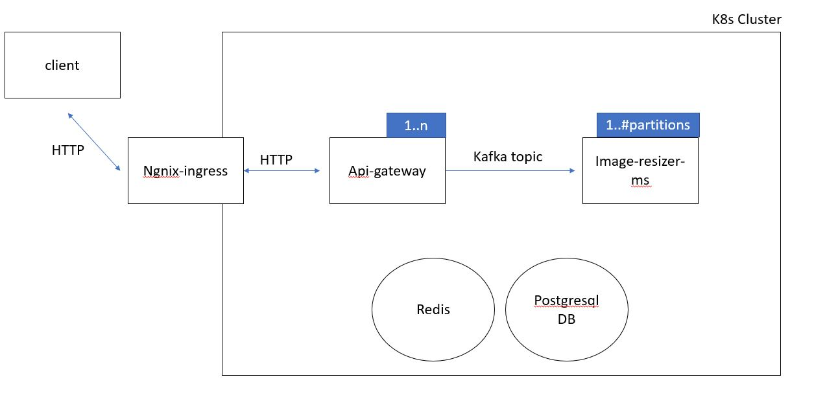

# # image-resizer
## Backend implenetation and API for image ressizing

# Constaraints:
- supported images formats: jpg/png.
- Max upload image size: 1MB, Max Image resolution: 10MP.

# Usage
#### Upload image:
-- Request:
- Method: Post 
- Path: /image-resizer/upload
- Content-type: multipart/form-data
- Key/values params: 
dimensions={"height": <TARGET_HEIGHT>, "width": <TARGET_WIDTH>} 
image=<IMAGE_PATH>

-- returns: The image request UUID.
--example:
```sh
curl -i -X POST -H "Content-Type: multipart/form-data" -F "image=@/home/cat.jpg"  -F "dimensions={\"height\": 500, \"width\": 500}" https://asafsibony.com/image-resizer/upload
```

#### Get Image Resizing Status:
 -- Request:
- Method: GET 
- Path: image-resizer/status/{IMAGE-UUID}

-- returns: The image request status: Done/Processing/Failed.
--example:
```sh
curl -i https://asafsibony.com/image-resizer/status/ab0c6ba1-76c8-4ac0-a664-7fc992861945
```

#### Get Image Resizing Status:
 -- Request:
- Method: GET 
- Path: https://asafsibony.com/image-resizer/download/{IMAGE-UUID}

-- returns: The resizied image.
--example:
```sh
curl -OJ  https://asafsibony.com/image-resizer/download/ab0c6ba1-76c8-4ac0-a664-7fc992861945
```

## High Level Design


- Api-gateway micro-service: Resposible to get all the HTTP requests from the client, handle or route them to the apropairate service.
- Image-resize microservice: Handles the image resize task.
- Kafka: messaging queue between the services.
- Postgres DB.
- Redis: for caching.

## Deployment:
- prerequisite requirements: running k8s cluster.
- deploy "api-gateway" and "image-resizer-ms":
```sh
cd deployment/k8s
kubectl apply -Rf .
```
- deploy postgres:
```sh
./deployment/helm/postgresql/install.sh
```
- deploy ingress-ngnix:
```sh
./deployment/helm/ingress-ngnix/install.sh
```
- deploy kafka:
```sh
./deployment/helm/kafka/install.sh
```
- deploy redis:
```sh
./deployment/helm/redis/install.sh
```

## TODO:
- Testing
- Return HTTP responses as a formatted JSON.
- Consider adding connection pooler for Postgres.